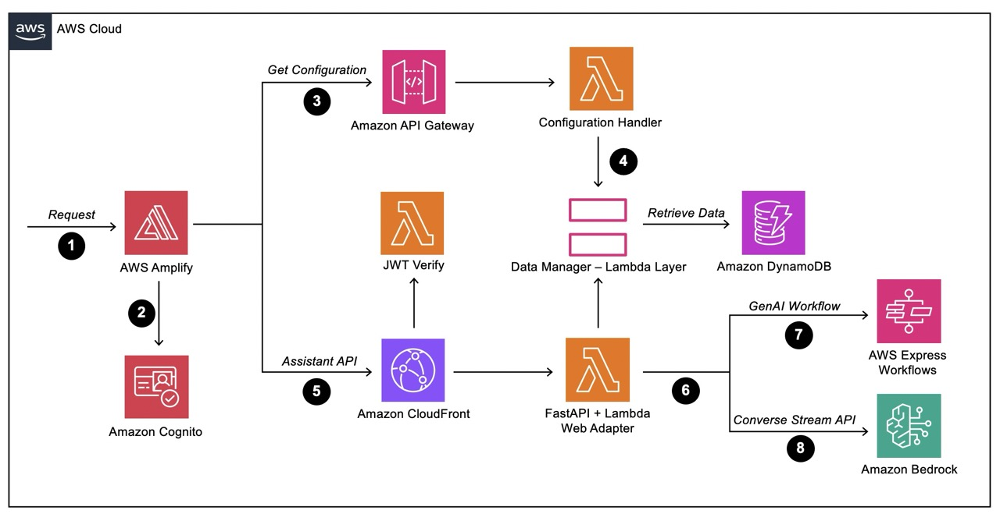
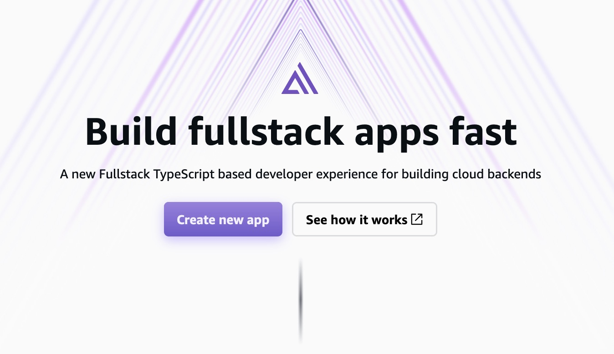
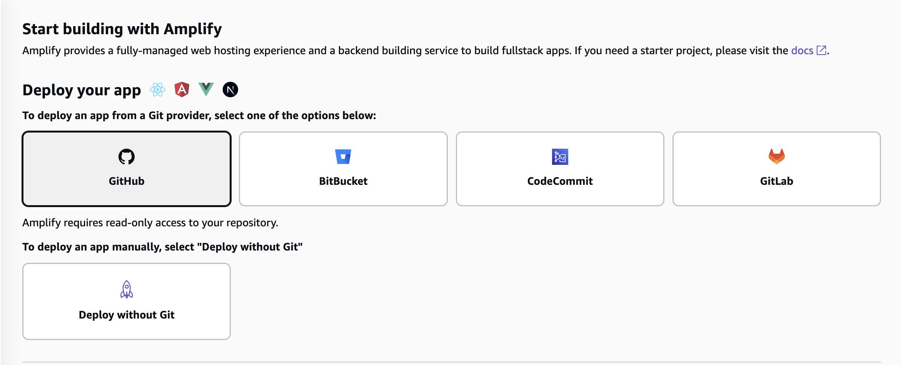
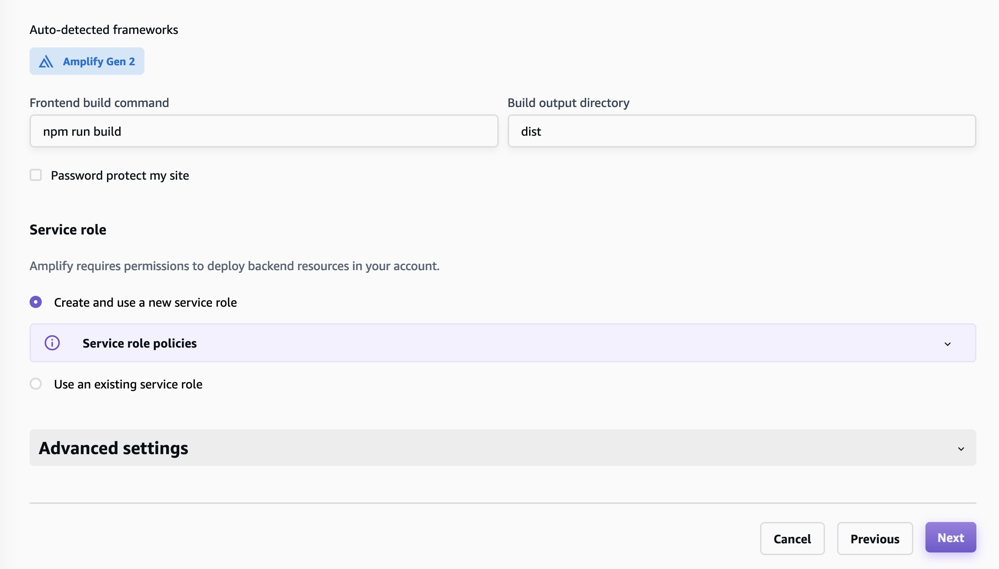
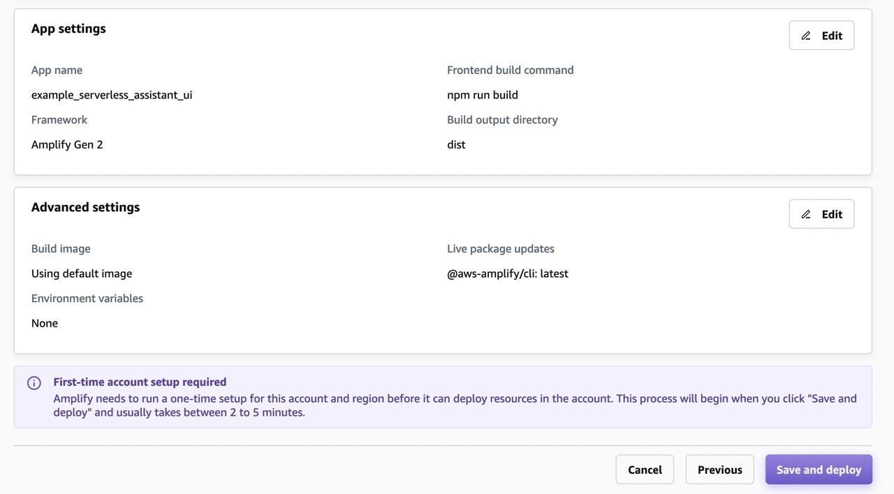
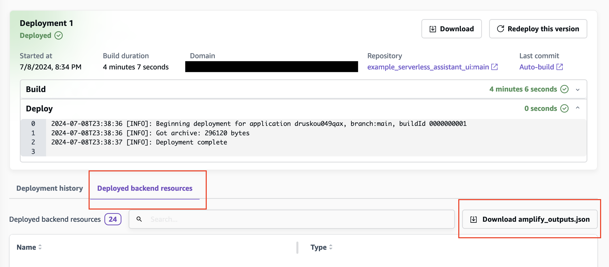
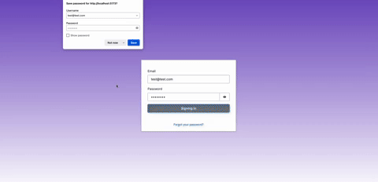

# Serverless GenAI Assistant - Web Application Sample

## Overview

The Serverless GenAI Assistant - Web Application Sample, demonstrates a pattern that combines serverless architecture with generative AI capabilities. This sample project demonstrates how to integrate this pattern showcasing both, frontend and backend components.

To enable this UI the [deep-chat](https://github.com/OvidijusParsiunas/deep-chat) component is used to perform the chat conversation. The deep-chat component is a flexible solution that enables the integration of chatbot/genai APIs with a frontend component.
To turn this integration possible it was necessary to create a [custom connection](https://deepchat.dev/docs/connect#request). Check the `ChatComponent.vue` if want to understand how it can be done.



1. Frontend: The user interface is hosted and managed using AWS Amplify. It handles the user request.
2. Authentication: Amazon Cognito is used for secure user authentication.
3. API Gateway: Manages API requests to retrieve configuration Data. THe JWT is also validated in API GW.
4. Lambda Configuration Handler: Holds the logic to identify API GW path request and execute data retrieval using Data Manager lambda layer that provides DynamoDB interface.
5. Cloudfront + JWT Verify: Provides an endpoint able to deliver stream response for authorized requests.
6. Lambda FastAPI: Using lambda web adapter, it received requests from cloudfront. All the requests are SigV4 signed and also the cognito access token is used to retrieve data using the Data handler layer.
7. Step Functions: Used to provide custom GenAI Workflows for different users.
8. Amazon Bedrock: Uses Converse API with response streaming.


## Work in Progress
This readme is in progress and wil be updated with more architecture details and usage instructions.

## Configuration data using Single Table Design

The information is stored based on an `account_id` that can represents a user or multiple users. The is added as a custom attribute 
in cognito and `account_id` is added to
JWT during the authentication phase on Cognito.

| Category | Field            | Value                                                               | Description                                                                         |
|----------|------------------|---------------------------------------------------------------------|-------------------------------------------------------------------------------------|
| **Account Details** |
| | Account ID       | uuid4                                                               | Unique identifier for the account                                                   |
| | Name             | Default account                                                     | Name of the account                                                                 |
| | Description      | Test account                                                        | Brief description of the account                                                    |
| **Inference Endpoint** |
| | Type             | cloudfront                                                          | The type of endpoint used                                                           |
| | URL              | http://cloudfront_domain/path                                       | The URL for the inference endpoint                                                  |
| | Description      | Endpoint for inference with stream response                         | Explanation of the endpoint's purpose                                               |
| **Workflow Details** |
| | Workflow ID      | 1                                                                   | Identifier for the workflow                                                         |
| | Name             | Test Workflow for account 1                                         | Name of the workflow                                                                |
| | Type             | stepfunctions                                                       | Type of the workflow                                                                |
| | ARN              | arn:aws:states:<region>:<account>:stateMachine:<state_machine_name> | Amazon Resource Name for the workflow                                               |
| | assistant_params | String representation of a JSON                                     | Contain the parameters to be sent to serverless assistant for the specific workflow |


## Features

- Scalable serverless architecture
- GenAI with Stream Response
- AWS Step Functions to create low code GenAI Workflows
- Cognito user authentication
- Web-based user interface
- Cognito Users can access different Workflow resources

## Architecture

The application leverages several AWS services:

- **Frontend**: Hosted and managed using AWS Amplify
- **Authentication**: Implemented with Amazon Cognito
- **Backend**: Deployed using AWS Serverless Application Model (SAM)


## Prerequisites

- AWS Account
- [AWS CLI](https://aws.amazon.com/cli/) installed and configured
- [Python 3.12](https://www.python.org/downloads/)
- [Boto3](https://boto3.amazonaws.com/v1/documentation/api/latest/guide/quickstart.html#installation)
- [AWS SAM CLI](https://docs.aws.amazon.com/serverless-application-model/latest/developerguide/serverless-sam-cli-install.html) installed
- [Node.js](https://nodejs.org/) and npm installed
- Git

## Deployment

The solution is deployed in two parts:

1. Amplify V2 (Frontend + Cognito)
2. SAM Template (Backend)

Note: It's planned to move the stack to CDK on Amplify. For now, it's necessary to configure the integration between the 
stacks.

### Frontend Deployment (Amplify)

This section uses the process as showed in [Amplify Quickstart](https://docs.amplify.aws/vue/start/quickstart/) 

1. Create a new repository on GitHub:
   ```
   https://github.com/new
   ```

2. Navigate to the `amplify_ui` directory:
   ```bash
   cd serverless-genai-assistant/examples/sample_web_application/amplify_ui
   ```

3. Initialize and push to the new repository:
   ```bash
   git init
   git add .
   git commit -m "Initial commit"
   git branch -M main
   git remote add origin git@github.com:<your-username>/<repository-name>.git
   git push -u origin main
   ```

4. Deploy the frontend using AWS Amplify Console:
   - Go to AWS Amplify Console
   - Click "Create new app" > "Host web app"
   
   

   - Select your git provider
   
   

   - Select your repository
   
   

   - Click on Next
   
   

   - Click on Save & Deploy
   
   

5. After deployment, note the Amplify Domain for accessing the UI. 
    - Click on the Branch

   

6. Download `amplify_outputs.json` from the Amplify Console:
   - Click on the branch to see more details
   - Click on "Deployed backend resources" and Download amplify_outputs.json
   
   

   Copy it to the `amplify_ui` directory:
   ```bash
   cp <download_directory>/amplify_outputs.json serverless-genai-assistant/examples/sample_web_application/amplify_ui
   ```

### Backend Deployment (SAM)

1. Update Cognito parameters in `lambda-jwt-verify/src/index.mjs`:
   ```javascript
   const verifier = CognitoJwtVerifier.create({
     userPoolId: "INSERT_COGNITO_USER_POOL_ID",
     tokenUse: "access",
     clientId: "INSERT_COGNITO_CLIENT_ID",
   });
   ```

2. Deploy the backend using SAM CLI, the Cognito UserPoolId and UserPoolClientId will be requested:
   ```bash
   cd serverless-genai-assistant/examples/sample_web_application/
   sam build
   sam deploy
   ```

4. Update `assistant_config.py` with the deployment outputs and run it:
   ```bash
   python serverless-genai-assistant/examples/sample_web_application/assistant_config.py
   ```

5. Update the `ConfigUrl` and the region in `amplify_ui/src/main.ts` with the SAM output endpoint.

   ```javascript
      AssistantConfigApi: {
        endpoint:
          '<INSERT_API_GATEWAY_ENDPOINT>',
        region: '<INSERT_REGION>'
      }
   ```

6. Commit the Amplify frontend with the updated configuration.

   ```bash
   cd serverless-genai-assistant/examples/sample_web_application/amplify_ui
   git commit -am  "API Gateway endpoint Updated"
   git push
   ```

Amplify will automatically deploy the changes.

## Usage

1. Access the application using the Amplify URL provided after deployment.
2. Log in using the credentials generated by the `assistant_config.py` script.
3. Interact with the GenAI Assistant through the web interface.


